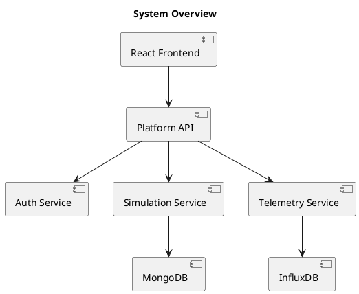
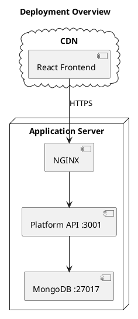
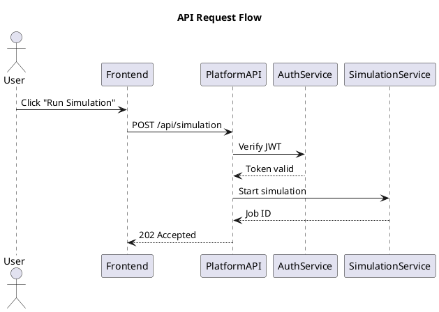
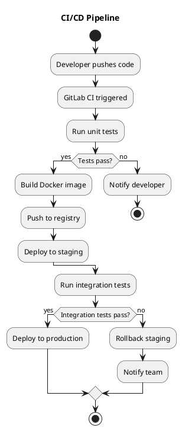
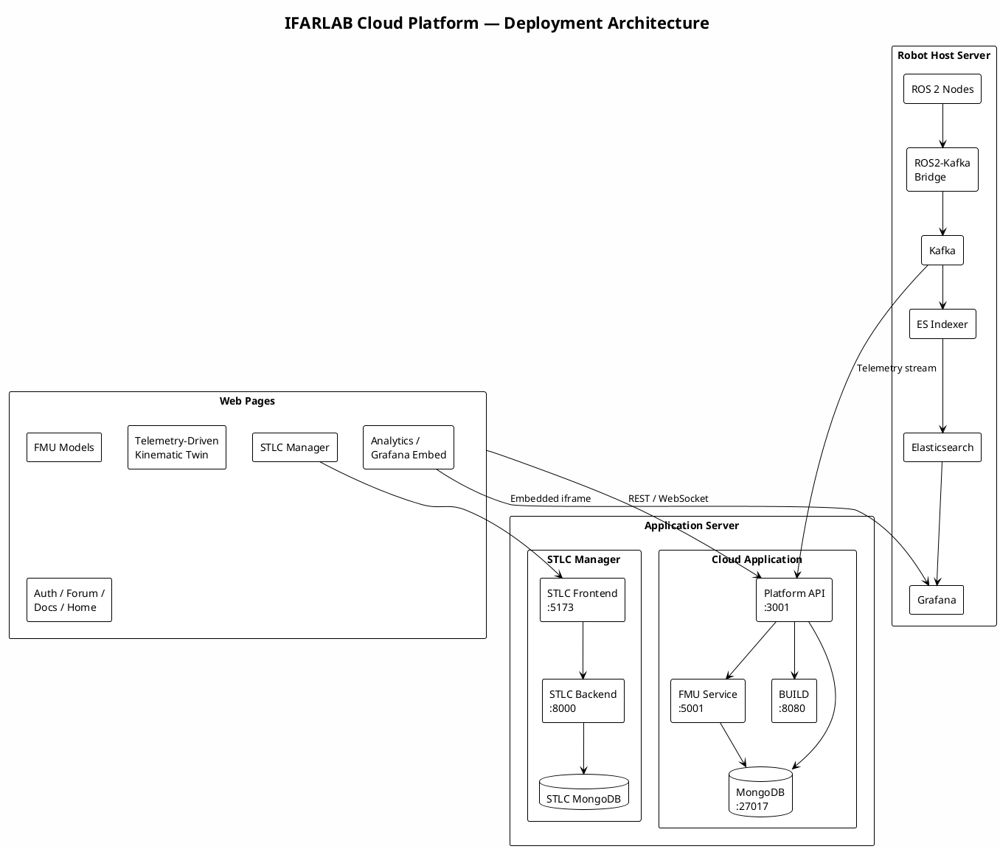

If you've ever tried to document a system's architecture, you know the pain: drag-and-drop tools produce pretty pictures that nobody updates. The diagram becomes outdated within weeks, and suddenly your documentation is misleading rather than helpful.

PlantUML solves this by letting you write diagrams as **code**. You describe the architecture in a simple text format, and PlantUML renders it into a diagram. Because it's text, you can version-control it in Git alongside your source code.

<!-- more -->

## Key Takeaways

- PlantUML diagrams are text files — they live in Git, get reviewed in PRs, and stay in sync with code.
- Deployment diagrams are the most useful type for documenting cloud/container-based systems.
- Start simple: a box-and-arrow overview is more valuable than a detailed diagram nobody reads.

## Why PlantUML Over GUI Tools?

There are many diagramming tools — Lucidchart, draw.io, Miro, Figma, Visio. They all work. But they share a common problem: **the diagram lives outside your codebase**.

PlantUML diagrams are plain `.puml` text files. This means:

1. **Version control** — Your architecture diagram evolves with your code. `git blame` tells you who changed what and when.
2. **Code review** — Diagram changes appear in pull requests. Reviewers can see exactly what changed.
3. **Automation** — CI/CD pipelines can render diagrams automatically and include them in documentation.
4. **No vendor lock-in** — It's open source. You're not dependent on a SaaS subscription.

The trade-off: PlantUML diagrams are less visually polished than hand-crafted GUI diagrams. For internal documentation, architecture decision records, and technical specs, that's perfectly fine.

## Getting Started

### Installation Options

PlantUML works in several environments:

- **VS Code** — Install the "PlantUML" extension by jebbs. Preview diagrams in real-time with `Alt+D`.
- **IntelliJ/JetBrains** — Built-in PlantUML support with the PlantUML Integration plugin.
- **Command line** — `java -jar plantuml.jar diagram.puml` renders to PNG or SVG.
- **Online** — The [PlantUML Web Server](https://www.plantuml.com/plantuml/) lets you try it without installing anything.
- **GitLab** — Renders PlantUML blocks natively in Markdown files.

For team use, I recommend keeping `.puml` files in your Git repository under a `docs/diagrams/` folder, and rendering them as part of your documentation pipeline.

## Diagram Types You'll Actually Use

PlantUML supports many diagram types. In practice, these four cover most software engineering needs:

### 1. Component Diagram — System Overview

Best for showing how services connect to each other.



### 2. Deployment Diagram — Where Things Run

Best for showing containers, servers, and network boundaries.



### 3. Sequence Diagram — Request Flow

Best for showing how a single request moves through the system.



### 4. Activity Diagram — Process Flow

Best for showing decision logic and workflows.



## Real Example: Cloud Platform Architecture

Here's a real-world example from a cloud platform I built for an academic research lab. The system integrates multiple backend services — simulation, telemetry, computer vision — behind a central Platform API.

This is the kind of diagram I keep in the project's GitLab repository, updated alongside the code.



### What This Diagram Shows

- **Robot Host Server** — Handles real-time telemetry. ROS 2 sensor data flows through a Kafka message queue, gets indexed into Elasticsearch, and is visualized in Grafana.
- **Application Server** — Hosts the main cloud application (Platform API, FMU simulation service, build tools) and a separate STLC (Software Testing Life Cycle) management subsystem.
- **Web Pages** — The frontend routes requests to the appropriate backend services.

### Why This Diagram Matters

Without this diagram, a new team member joining the project would need days to understand how the pieces connect. With it, the onboarding conversation takes 15 minutes.

Notice that the diagram doesn't show every endpoint or every database field. It shows **deployment boundaries and data flow** — the two things that matter most when you're trying to understand a distributed system.

## PlantUML Syntax Essentials

Here's a quick reference for the most common elements:

### Containers and Components

```
node "Server Name" {        ' A physical/virtual server
  component "Service" as s1  ' A software component
  database "DB Name" as db   ' A database
  queue "Queue" as q         ' A message queue
}

cloud "Cloud" {              ' Cloud boundary
  [Service Name]             ' Shorthand for component
}

rectangle "Group" {          ' Logical grouping
  [A] --> [B]
}
```

### Relationships

```
A --> B          ' Solid arrow (dependency/flow)
A ..> B          ' Dotted arrow (optional/async)
A --> B : label  ' Arrow with label
A <--> B         ' Bidirectional
```

### Styling

```
skinparam backgroundColor #FEFEFE
skinparam componentStyle rectangle
!theme plain
```

PlantUML themes (`plain`, `cerulean`, `mars`, etc.) change the visual appearance without modifying the diagram structure.

## Practical Tips

### 1. One diagram per concern

Don't try to show everything in a single diagram. Separate diagrams work better:
- **Deployment diagram** — what runs where
- **Sequence diagram** — how a specific request flows
- **Component diagram** — high-level service dependencies

### 2. Name your files clearly

```
docs/
  diagrams/
    deployment-overview.puml
    auth-flow-sequence.puml
    ci-cd-pipeline.puml
```

### 3. Keep diagrams close to the code they describe

If a diagram shows how a specific service works, put the `.puml` file in that service's directory. If it's a system-wide overview, put it in the root `docs/` folder.

### 4. Update diagrams in the same PR as code changes

If you add a new service, update the deployment diagram in the same pull request. This is the key advantage of text-based diagrams — they're part of the code review process.

### 5. Use `!include` for shared definitions

If multiple diagrams use the same components, extract them:

```plantuml
' shared/components.puml
component "Platform API" as api
database "MongoDB" as mongo
```

```plantuml
' diagrams/deployment.puml
!include shared/components.puml
api --> mongo
```

## Common Mistakes

**Mistake 1: Too much detail.** A diagram with 50 components and 80 arrows helps nobody. If you need that level of detail, split it into multiple focused diagrams.

**Mistake 2: Not updating the diagram.** A stale diagram is worse than no diagram — it actively misleads. If you version-control diagrams in Git, CI/CD can catch drift.

**Mistake 3: Using PlantUML for everything.** Some diagrams (whiteboard sketches, user journey maps, wireframes) are better in visual tools. PlantUML excels at **technical architecture and flow diagrams**.

## Tools and Integration

| Tool | PlantUML Support |
|------|-----------------|
| **VS Code** | PlantUML extension (jebbs) — real-time preview |
| **GitLab** | Native rendering in Markdown |
| **GitHub** | Use GitHub Actions to render and commit PNGs |
| **Confluence** | PlantUML macro plugin |
| **Markdown** | Embed rendered images or use Mermaid as alternative |

For CI/CD integration, you can add a step that renders all `.puml` files to SVG and publishes them to your documentation site:

```bash
java -jar plantuml.jar -tsvg docs/diagrams/*.puml
```

## When to Use PlantUML vs Alternatives

| Use Case | Recommended Tool |
|----------|-----------------|
| Technical architecture diagrams | **PlantUML** |
| Sequence diagrams in docs | **PlantUML** or Mermaid |
| Quick whiteboard sketches | Excalidraw or physical whiteboard |
| User-facing diagrams in presentations | Figma, Lucidchart |
| Entity-relationship diagrams | dbdiagram.io or PlantUML |
| Embedded diagrams in GitHub Markdown | Mermaid (native support) |

PlantUML is strongest when you need **version-controlled, reviewable, automatable** technical diagrams.

## Further Reading

- [PlantUML Official Documentation](https://plantuml.com/)
- [PlantUML Standard Library](https://plantuml.com/stdlib) — icons for AWS, Azure, Kubernetes, etc.
- [C4 Model with PlantUML](https://github.com/plantuml-stdlib/C4-PlantUML) — structured architecture diagrams using the C4 model

*Have a diagram workflow that works well for your team? I'd love to hear about it — connect on [LinkedIn](https://www.linkedin.com/in/burak2kanber/) or [GitHub](https://github.com/datkanber).*

## Related Posts

- 
- 
